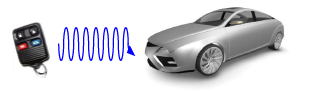
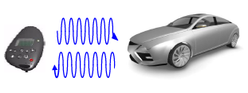

# Requirements 
## **Content**
| Sr. No. | Content                 |
| ------- | ----------------------- |
| 1.      | Problem statement       |
| 2.      | Solution                |
| 3.      | Abstract                |
| 4.      | Features                |
| 5.      | SWOT analysis           |
| 6.      | 5W'1 and 1H             |
| 7.      | High Level Requirements |
| 8.      | Low Level Requirements  |
------------------------------------------------------------------------------------------------------

## **Problem Statement:** 
- ### Remote Keyless Entry System
    - The RKE system should unidirectionally perform operations like locking/unlocking the car, activating/deactivating alarm through the RKE key fob to the body control ECU which is intergrated with RKE.
- ### BiCom System
    - The BiCom system should perform the unidirectional features of the RKE. Along with that it should also communicate from the car to key fob by sending car status information to the keyfob display. 
-----------------------------------------------------------------------------------------------------

## **Solution:** 
- ### Remote Keyless Entry System
    - To implement the following system our project performs these operations: 
        1. To lock the car: 
            Print lock (Blue switch on- All led on at the same time)
        2. To unlock the car:
            Print unlock (Blue switch press two times- All led off at the same time)
        3. To activate/deactivate alarm:
            Print alarm activation/deactivation (Blue switch press three times- All led on in clockwise manner)
        4. To turn on approaching lights:
            Print approach light (Blue switch press four times- All led on in anti-clockwise manner)

- ### BiCom System
    - To implement the following system our project performs these operations: 
        1. To show window status: 
            Print window status (Blue switch on- All led on at the same time)
        1. To show alarm status:
            Print alarm status (Blue switch press two times- All led off at the same time)
        2. To show car's battery status:
            Print car battery info (Blue switch press three times- All led on in clockwise manner)
        3. To show door status:
            Print door status (Blue switch press four times- All led on in anti-clockwise manner)
-----------------------------------------------------------------------------------------------------

## **Abstract:** 
- ### Remote Keyless Entry System
    Remote keyless entry (RKE) system is a system designed to perfom remote lock or unlock access to automobiles. Here, the RKE transmits the specific frequency radio wave to the receiver and the specified operation is completed. RKE has captivated automobile buyers, as evidenced by its popularity on new vehicles and as an aftermarket item. 
    This project provides an overview of RKE systems and its functional design and requirements along with its analysis on various fronts and implementation. 

- ### BiCom System
    A BiCom system is the extention of the unidirectional RKE to bidirectional RKE system. This BiCom system offers increased security compared to uni-directional RKE system. Here, the key fob authenticates the vehicle before replying. Meaning the RKE transmits the specific frequency radio wave to the receiver and then the vehicle authenticates the fob by transmitting the status back.
    This project provides an overview of BiCom systems and its functional design and requirements along with its analysis on various fronts and implementation. 

-----------------------------------------------------------------------------------------------------

## **Features:** 
- ### Remote Keyless Entry System
    - Car is locked when the switch is pressed once.
    - Car is unlocked when the switch is pressed twice.
    - Alarm of the car gets activated/deactivated when the switch is pressed thrice.
    - Approaching lights are turned on when the switch is pressed four times.

- ### BiCom System
    - Window status of the car is displayed when the switch is pressed once.
    - Alarm status of the car is displayed when the switch is pressed twice.
    - Battery status of the car is displayed when the switch is pressed thrice.
    - Door status of the car is displayed when the switch is pressed four times.
-----------------------------------------------------------------------------------------------------

## **SWOT Analysis:** 
- ### Remote Keyless Entry System

- ### BiCom System

-----------------------------------------------------------------------------------------------------

## **5W's and 1H:** 
- ### Remote Keyless Entry System

- ### BiCom System

-----------------------------------------------------------------------------------------------------

## **High Level Requirements:** 
- ### Remote Keyless Entry System
    |   ID   | Description                                                      |
    | :----: | :--------------------------------------------------------------- |
    | HLR0.1 | Must be able to remotely lock the vehicle                        |
    | HLR0.2 | Must be able to remotely unlock the vehicle                      |
    | HLR0.3 | Must be able to remotely activate/deactivate the vehicle's alarm |
    | HLR0.4 | Must be able to remotely turn on vehicle's approach lights       |
    
- ### BiCom System
    |   ID   | Description                                   |
    | :----: | :-------------------------------------------- |
    | HLR1.1 | Must display the window status of the vehicle |
    | HLR1.2 | Must display the alarm status of the vehicle  |
    | HLR1.3 | Must display the battery status of the vehicle |
    | HLR1.4 | Must display the door status of the vehicle   |
-----------------------------------------------------------------------------------------------------

## **Low Level Requirements:** 
- ### Remote Keyless Entry System
    |   ID   | Description                                                                   | HLRID  |
    | :----: | :---------------------------------------------------------------------------- | ------ |
    | LLR0.1 | Vehicle must get locked when blue switch is pressed once                      | HLR0.1 |
    | LLR0.2 | All LEDs must turn on when blue switch is pressed once                        | HLR0.1 |
    | LLR0.3 | Vehicle must get unlocked when blue switch is pressed twice                   | HLR0.2 |
    | LLR0.4 | All LEDs must turn off when blue switch is pressed twice                      | HLR0.2 |
    | LLR0.5 | Alarm must be activated/deactivated when blue switch is pressed thrice        | HLR0.3 |
    | LLR0.6 | All LEDs must turn on in clockwise manner when blue switch is pressed thrice  | HLR0.3 |
    | LLR0.7 | Vehicle's approach light must turn on when blue switch is pressed four times  | HLR0.4 |
    | LLR0.8 | All LEDs must turn on in anti-clockwise manner when blue switch is four times | HLR0.4 |

- ### BiCom System
    |   ID   | Description                                                                   | HLRID  |
    | :----: | :---------------------------------------------------------------------------- | ------ |
    | LLR1.1 | Vehicle must display the window status when blue switch is pressed once       | HLR1.1 |
    | LLR1.2 | All LEDs must turn on when blue switch is pressed once                        | HLR1.1 |
    | LLR1.3 | Vehicle must display alarm status when blue switch is pressed twice           | HLR1.2 |
    | LLR1.4 | All LEDs must turn off when blue switch is pressed twice                      | HLR1.2 |
    | LLR1.5 | Vehicle must display battery status when blue switch is pressed thrice        | HLR1.3 |
    | LLR1.6 | All LEDs must turn on in clockwise manner when blue switch is pressed thrice  | HLR1.3 |
    | LLR1.7 | Vehicle must display door status when blue switch is pressed four times       | HLR1.4 |
    | LLR1.8 | All LEDs must turn on in anti-clockwise manner when blue switch is four times | HLR1.4 |
-----------------------------------------------------------------------------------------------------
